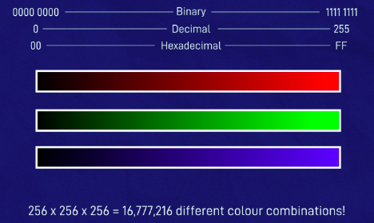
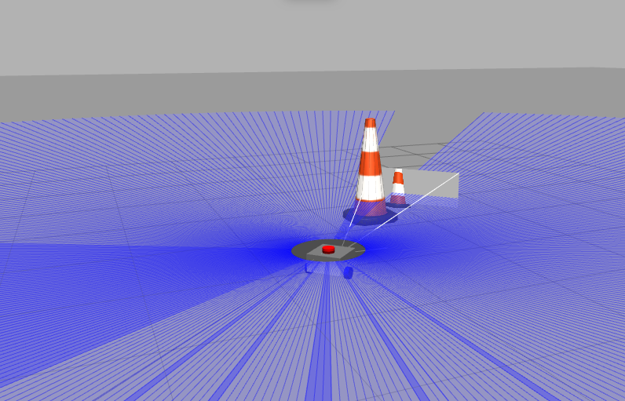

# Финальная работа

## Общее описание

В своей работе предполагаю спланировать робот начального уровня с дифференциальным приводом, на котором будет установлен лидар, и камера глубины, а также разработать проект, в котором удасться управлять реальной камерой (в моем случае камера ноутбука), в целях изучения работы ROS2 с реальным устройством.
ROS2 предполагаю использовать в виду того, что поддержка ROS в скором времени прекратится, тем более пока я его изучу :)

ROS2 установлен в ходе обучения на курсе "Linux для робототехников" в виртуальную машину с Ubuntu 22.04

## Работа с реальной камерой

Работу с реальной камерой ноутбука изучал в основном по статье ["Простая установка ROS2 на Ubuntu 22.04: Руководство для начинающих"](https://habr.com/ru/articles/768048/) с добавлением информации из других источников, т.к. в чистом виде сразу многое не работало.

### Настройка камеры в виртуальной машине

Камера к сожалению не работала в виртуальной машине. И значительное количество способов не помагало. Опишу, в первую очередь для себя на будущее, метод решения данной проблемы.

1. Только через командную строку установить гостевые дополнения и пакет расширений для VirtualBox

```bash
sudo apt-get install virtualbox-guest-additions-iso virtualbox-ext-pack
```

2. Добавить пакет расширений через сам Virtualbox. В принципе, на шаге 1 я предположил, что в этом нет необходимости. Но шаг 3 ниже не нашел веб-камеру. Поэтому я решил установить этот пакет. Установка сообщила об ошибке, но все равно все работало нормально. Еще одна работа позволит выяснить, можно ли удалить/не установить какую-либо из двух версий пакета.  
   Загрузить файл пакета расширений (в настоящее время 6.1.6) и добавьте его с помощью Файл -> Настройки -> Расширения -> Добавляет новый пакет (найдите загруженный файл). Примечание. Я видел упоминания о том, что могут возникнуть проблемы при обновлении VBox, а не при обновлении расширений. Возможно, выполнение этого через apt-get избавит от этой проблемы.  
   В моем случае команда сработала и шаг 2 не потребовался.
3. Проверяю, распознана ли веб-камера и узнаю ее имя (в основной системе, котрая у меня Ubuntu 20.04):

```bash
VBoxManage list webcams
```

Что показало наличие 1 камеры на моем ноуте:  
  
4. Командой подключил веб-камеру к виртуальной машине

```bash
VBoxManage controlvm ubuntu22 webcam attach /dev/video0
```

Здесь у меня:

- ubuntu22 - наименование виртуальной машины, к которой подключаю веб-камеру
- /dev/video0 - путь к камере, который я получил на шаге 4.  
  Только после данных шагов, камера стала доступна в виртуальной машине.

### Создание ноды CaptureCamera

1. Конечно же стоит предварительно установить модули работы с камерой и [ изображениями](https://pypi.org/project/opencv-python/)

```bash
pip install opencv-python
sudo apt install ros-humble-cv-bridge
```

2. Для создания ноды создаю новый пакет

```bash
cd ~/dev_ws/src
ros2 pkg create --build-type ament_python capture_camera
```

3. Создаю новый Python-файл в созданном пакете по пути:  
   `~/dev_ws/src/capture_camera/capture_camera/capture_camera.py`
4. capture_camera.py  
   Это нода будет выполнять следующие задачи:

- Получение изображений: С помощью камеры, используя библиотеку OpenCV
- Обработка и публикация: Используя библиотеку cv_bridge, нода преобразует полученные изображения в формат, совместимый с ROS, и отправляет их в топик camera/image. Это делает изображения доступными для других нод в ROS.
- Публикация информации: Она также отправляет текстовые сообщения, которые содержат информацию о времени захвата каждого изображения, в топик camera/info.
- Сохранение изображений: Функция save_image сохраняет захваченные изображения в определённой директории и ограничивает количество хранящихся изображений до последних 20, удаляя старые.
- Таймеры: Устанавливаются два таймера — один для функции capture_and_publish, вызываемой каждую секунду для захвата и публикации изображений, и второй для функции save_image, вызываемой каждые 5 секунд для сохранения изображений.

```python
# Импортируем необходимые библиотеки
import rclpy
from rclpy.node import Node
from cv_bridge import CvBridge
from sensor_msgs.msg import Image
from std_msgs.msg import String
import cv2
import time
import os
import glob

# Определяем класс CaptureCameraNode, который является ROS2-нодой для захвата изображений с камеры
class CaptureCameraNode(Node):
    def __init__(self):
        # Инициализируем родительский класс Node с именем 'capture_camera'
        super().__init__('capture_camera')

        # Создаем объект CvBridge для преобразования изображений между OpenCV и ROS
        self.bridge = CvBridge()

        # Создаем издателей для публикации изображений и текстовых сообщений
        self.publisher = self.create_publisher(Image, 'camera/image', 10)
        self.text_publisher = self.create_publisher(String, 'camera/info', 10)

        # Определяем путь к устройству камеры
        # path = "/dev/v4l/by-path/platform-fd500000.pcie-pci-0000:01:00.0-usb-0:1.2:1.0-video-index0"
        # Инициализируем объект VideoCapture для захвата видео с камеры
        # self.cap = cv2.VideoCapture(path, cv2.CAP_V4L)
        self.cap = cv2.VideoCapture(0)
        print("Camera created", self.cap)

        # Создаем таймер, который вызывает функцию capture_and_publish каждую секунду
        self.timer = self.create_timer(1.0, self.capture_and_publish)

        # Определяем путь для сохранения изображений
        self.image_save_path = "/home/dax/images"
        # Если папка для сохранения изображений не существует, создаем ее
        os.makedirs(self.image_save_path, exist_ok=True)

        # Создаем таймер, который вызывает функцию save_image каждые 5 секунд
        self.save_timer = self.create_timer(5.0, self.save_image)

    # Функция для захвата и публикации изображения
    def capture_and_publish(self):
        # Захватываем изображение с камеры
        ret, frame = self.cap.read()
        if ret:
            # Выводим текущее время захвата на консоль
            print("Last time of get image:", time.ctime())

            # Преобразуем изображение в формат ROS и публикуем его
            msg = self.bridge.cv2_to_imgmsg(frame, "bgr8")
            self.publisher.publish(msg)

            # Подготавливаем и публикуем текстовое сообщение с временем захвата изображения
            msg = String()
            msg.data = f"Last time of get image: {time.ctime()}"
            self.text_publisher.publish(msg)

    # Функция для сохранения изображения и обеспечения хранения только 20 последних изображений
    def save_image(self):
        ret, frame = self.cap.read()
        if ret:
            # Сохраняем изображение с учетом временной метки
            timestamp = time.strftime("%Y%m%d-%H%M%S")
            filename = os.path.join(self.image_save_path, f"image_{timestamp}.jpg")
            cv2.imwrite(filename, frame)
            print(f"Saved image to {filename}")

            # Получаем список всех сохраненных изображений
            all_images = glob.glob(os.path.join(self.image_save_path, "*.jpg"))
            # Сортируем список изображений по дате создания
            sorted_images = sorted(all_images, key=os.path.getmtime)
            # Удаляем старые изображения, оставляя только 20 последних
            while len(sorted_images) > 20:
                os.remove(sorted_images[0])
                del sorted_images[0]

def main(args=None):
    # Инициализируем ROS
    rclpy.init(args=args)
    # Создаем объект нашей ноды
    capture_camera = CaptureCameraNode()
    # Запускаем цикл обработки ROS
    rclpy.spin(capture_camera)

if __name__ == '__main__':
    main()
```

5. Вношу изменения в настройки пакета  
   `~/dev_ws/src/capture_camera/setup.py`

```python
from setuptools import find_packages, setup

package_name = 'capture_camera'

setup(
    name=package_name,
    version='0.0.0',
    packages=find_packages(exclude=['test']),
    data_files=[
        ('share/ament_index/resource_index/packages',
            ['resource/' + package_name]),
        ('share/' + package_name, ['package.xml']),
    ],
    install_requires=['setuptools'],
    zip_safe=True,
    maintainer='dax',
    maintainer_email='John-Xenos@yandex.ru',
    description='TODO: Package description',
    license='TODO: License declaration',
    tests_require=['pytest'],
    entry_points={
        'console_scripts': [
                'capture_camera = capture_camera.capture_camera:main'
        ],
    },
)
```

6. Компилирую созданную ноду

```bash
sudo apt install python3-colcon-common-extensions
cd ~/dev_ws/
colcon build
source install/setup.bash
```

7. Запускаю ноду

```bash
ros2 run capture_camera capture_camera
```


Все отлично работает!

### Создание ноды ProcessingCamera

Данная нода будет получать изображение и обрабатывать его.  
Эта нода будет подписана на топик camera/image, где она будет ожидать поступления изображений от ноды захвата камеры.  
В этой ноде также используется CvBridge для преобразования изображений из формата, понятного ROS, в формат, с которым может работать библиотека OpenCV. Каждый раз, когда в топик приходит новое изображение, вызывается функция image_callback. В этой функции изображение преобразуется в формат OpenCV, что позволяет ноде ProcessingCamera анализировать и обрабатывать изображение.  
В моем случае просто буду читать разрешение картинки и выводить его в консоль.

1. Создаю новый пакет

```bash
cd ~/dev_ws/src
ros2 pkg create --build-type ament_python processing_camera
```

2. Создаю новый Python-файл по пути  
   `~/dev_ws/src/processing_camera/processing_camera/processing_camera.py`
3. processing_camera.py

```python
import rclpy
from rclpy.node import Node
from cv_bridge import CvBridge
from sensor_msgs.msg import Image

class ImageReaderNode(Node):

    def __init__(self):
        super().__init__('image_reader_node')  # Инициализируем родительский класс Node с именем 'image_reader_node'

        # Создаем объект CvBridge для преобразования изображений между OpenCV и ROS
        self.bridge = CvBridge()

        # Подписываемся на тему 'camera/image' для чтения изображений
        self.subscription = self.create_subscription(
            Image,
            'camera/image',
            self.image_callback,
            10
        )
        self.subscription

    def image_callback(self, msg):
        # Преобразуем изображение из формата ROS в формат OpenCV
        cv_image = self.bridge.imgmsg_to_cv2(msg, "bgr8")

        # Получаем разрешение изображения
        height, width, _ = cv_image.shape
        print(f"Image resolution: {width}x{height}")

def main(args=None):
    rclpy.init(args=args)
    image_reader = ImageReaderNode()
    rclpy.spin(image_reader)

if __name__ == '__main__':
    main()
```

4. Вношу изменения в настройки пакета  
   `~/dev_ws/src/processing_camera/setup.py`

```python
from setuptools import find_packages, setup

package_name = 'processing_camera'

setup(
    name=package_name,
    version='0.0.0',
    packages=find_packages(exclude=['test']),
    data_files=[
        ('share/ament_index/resource_index/packages',
            ['resource/' + package_name]),
        ('share/' + package_name, ['package.xml']),
    ],
    install_requires=['setuptools'],
    zip_safe=True,
    maintainer='dax',
    maintainer_email='John-Xenos@yandex.ru',
    description='TODO: Package description',
    license='TODO: License declaration',
    tests_require=['pytest'],
    entry_points={
        'console_scripts': [
                'processing_camera = processing_camera.processing_camera:main'
        ],
    },
)
```

5. Компилирую

```bash
cd ~/dev_ws/
source install/setup.bash
colcon build
```

6. Запускаю обе ноды в разных терминалах

```bash
cd ~/dev_ws/
source install/setup.bash
ros2 run capture_camera capture_camera


cd ~/dev_ws/
source install/setup.bash
ros2 run processing_camera processing_camera
```


Все отлично работает!

### Создание ноды InfoReaderNode

Данная нода будет читать текстовые сообщения из топика camera/info в выводить их в консоль.

1. Создаю новый пакет

```bash
cd ~/dev_ws/src
ros2 pkg create --build-type ament_python processing_info_camera
```

2. Создаю новый Python-файл по пути  
   `~/dev_ws/src/processing_info_camera/processing_info_camera/processing_info_camera.py`
3. processing_info_camera.py

```python
import rclpy
from rclpy.node import Node
from cv_bridge import CvBridge
from std_msgs.msg import String

class InfoReaderNode(Node):

    def __init__(self):
        super().__init__('info_reader_node')  # Инициализируем родительский класс Node с именем 'info_reader_node'

        # Подписываемся на тему 'camera/image' для чтения изображений
        self.subscription = self.create_subscription(
            String,
            'camera/info',
            self.info_callback,
            10
        )
        self.subscription

    def info_callback(self, msg):
        # Вывожу полученное сообщение в консоль
        print(f"Received info: {msg.data}")

def main(args=None):
    rclpy.init(args=args)
    info_reader = InfoReaderNode()
    rclpy.spin(info_reader)

if __name__ == '__main__':
    main()
```

4. Вношу изменения в настройки пакета  
   `~/dev_ws/src/processing_info_camera/setup.py`

```python
from setuptools import find_packages, setup

package_name = 'processing_info_camera'

setup(
    name=package_name,
    version='0.0.0',
    packages=find_packages(exclude=['test']),
    data_files=[
        ('share/ament_index/resource_index/packages',
            ['resource/' + package_name]),
        ('share/' + package_name, ['package.xml']),
    ],
    install_requires=['setuptools'],
    zip_safe=True,
    maintainer='dax',
    maintainer_email='John-Xenos@yandex.ru',
    description='TODO: Package description',
    license='TODO: License declaration',
    tests_require=['pytest'],
    entry_points={
        'console_scripts': [
                'processing_info_camera = processing_info_camera.processing_info_camera:main'
        ],
    },
)
```

5. Компилирую

```bash
cd ~/dev_ws/
source install/setup.bash
colcon build
```

6. Запускаю обе ноды в разных терминалах

```bash
cd ~/dev_ws/
source install/setup.bash
ros2 run capture_camera capture_camera


cd ~/dev_ws/
source install/setup.bash
ros2 run processing_info_camera processing_info_camera
```


Все отлично работает!

### Создание launch-файла

Последний штрих.  
Для удобного запуска нод, находящихся в разных пакетах ROS2, нужно создать launch-файл. Обычно launch-файл размещается в папке launch внутри одного из пакетов ROS2 или в отдельном пакете, предназначенном только для launch-файлов.

1. В пакете `capture_camera` создаю папку `launch`, в который помещаю файл _camera_launch.py_

```python
from launch import LaunchDescription
from launch_ros.actions import Node

def generate_launch_description():
    return LaunchDescription([
        # Запуск ноды захвата изображений
        Node(
            package='capture_camera',
            executable='capture_camera',
            name='capture_camera'
        ),
        # Запуск ноды для чтения изображений и вывода их размеров
        Node(
            package='processing_camera',
            executable='processing_camera',
            name='processing_camera'
        ),
        # Запуск ноды для чтения текстовой информации из camera/info
        Node(
            package='processing_info_camera',
            executable='processing_info_camera',
            name='processing_info_camera'
        ),
    ])
```

2. Добавляю launch-файл в пакет _capture_camera_, для чего прописываю его в файле _setup.py_ в разделе _data_files_

```python
from setuptools import find_packages, setup
import os

package_name = 'capture_camera'

setup(
    name=package_name,
    version='0.0.0',
    packages=find_packages(exclude=['test']),  # Exclude any directories named 'test'
    data_files=[
        ('share/ament_index/resource_index/packages',
            ['resource/' + package_name]),
        ('share/' + package_name, ['package.xml']),
        # Включаем launch файлы
        (os.path.join('share', package_name, 'launch'), ['launch/camera_launch.py']),
    ],
    install_requires=['setuptools'],
    zip_safe=True,
    maintainer='dax',
    maintainer_email='John-Xenos@yandex.ru',
    description='TODO: Package description',
    license='TODO: License declaration',
    tests_require=['pytest'],
    entry_points={
        'console_scripts': [
            'capture_camera = capture_camera.capture_camera:main',
        ],
    },
)
```

Теперь запуск может проводиться с помощью launch-файла.  
3. Для этого необходимо убедиться, что среда ROS 2 активирована:  
`source /opt/ros/humble/setup.bash  # замените "humble" на вашу версию ROS 2, если она другая`  
4. Перехожу в корневую папку workspace пересобираю пакет, обновляю текущую сессию терминала с необходимыми переменными среды и конфигурациями для работы с ROS и запускаю launch-файл:

```bash
cd ~/dev_ws
colcon build
source install/setup.bash
ros2 launch capture_camera camera_launch.py
```


Все отлично работает!

## Моделирование робота

Моделирование робота изучал на канале [Articulated Robotics](https://www.youtube.com/watch?v=OWeLUSzxMsw&list=PLunhqkrRNRhYAffV8JDiFOatQXuU-NnxT) и соответственно отдельные источники по конкретным темам, таких как URDF, XACRO, GAZEBO и т.д.

Из [Articulated Robotics](https://www.youtube.com/watch?v=OWeLUSzxMsw&list=PLunhqkrRNRhYAffV8JDiFOatQXuU-NnxT) взял исходный шаблон для моделирования робота под ROS2, но проект переназвал как **skillboxbot_one**. Сам шаблон состоит из:

- папка **config**
  - файл **_empty.yaml_**
  ```yaml
  # This is an empty file, so that git commits the folder correctly
  ```
- папка **description**
  - файл **_robot.urdf.xacro_**
  ```xml
  <?xml version="1.0"?>
  <robot xmlns:xacro="http://www.ros.org/wiki/xacro"  name="robot">
      <!-- Example link -->
      <link name="base_link"></link>
  </robot>
  ```
- папка **launch**

  - файл **_rsp.launch.py_**

  ```python
  import os
  from ament_index_python.packages import get_package_share_directory
  from launch import LaunchDescription
  from launch.substitutions import LaunchConfiguration
  from launch.actions import DeclareLaunchArgument
  from launch_ros.actions import Node
  import xacro

  def generate_launch_description():
      # Check if we're told to use sim time
      use_sim_time = LaunchConfiguration('use_sim_time')
      # Process the URDF file
      pkg_path = os.path.join(get_package_share_directory('skillboxbot_one'))
      xacro_file = os.path.join(pkg_path,'description','robot.urdf.xacro')
      robot_description_config = xacro.process_file(xacro_file)
      # Create a robot_state_publisher node
      params = {'robot_description': robot_description_config.toxml(), 'use_sim_time': use_sim_time}
      node_robot_state_publisher = Node(
          package='robot_state_publisher',
          executable='robot_state_publisher',
          output='screen',
          parameters=[params]
      )
      # Launch!
      return LaunchDescription([
          DeclareLaunchArgument(
              'use_sim_time',
              default_value='false',
              description='Use sim time if true'),
          node_robot_state_publisher
      ])
  ```

- папка **worlds**
  - файл **_empty.world_**
  ```xml
  <?xml version="1.0" ?>
  <sdf version="1.5">
      <world name="default">
          <!-- A global light source -->
          <include>
          <uri>model://sun</uri>
          </include>
          <!-- A ground plane -->
          <include>
          <uri>model://ground_plane</uri>
          </include>
      </world>
  </sdf>
  ```
- файл **_CMakeLists.txt_**

  ```bash
  cmake_minimum_required(VERSION 3.5)
  project(skillboxbot_one)

  # Default to C99
  if(NOT CMAKE_C_STANDARD)
      set(CMAKE_C_STANDARD 99)
  endif()

  # Default to C++14
  if(NOT CMAKE_CXX_STANDARD)
      set(CMAKE_CXX_STANDARD 14)
  endif()

  if(CMAKE_COMPILER_IS_GNUCXX OR CMAKE_CXX_COMPILER_ID MATCHES "Clang")
      add_compile_options(-Wall -Wextra -Wpedantic)
  endif()

  # find dependencies
  find_package(ament_cmake REQUIRED)
  # uncomment the following section in order to fill in
  # further dependencies manually.
  # find_package(<dependency> REQUIRED)

  if(BUILD_TESTING)
      find_package(ament_lint_auto REQUIRED)
      # the following line skips the linter which checks for copyrights
      # uncomment the line when a copyright and license is not present in all source files
      #set(ament_cmake_copyright_FOUND TRUE)
      # the following line skips cpplint (only works in a git repo)
      # uncomment the line when this package is not in a git repo
      #set(ament_cmake_cpplint_FOUND TRUE)
      ament_lint_auto_find_test_dependencies()
  endif()

  install(
      DIRECTORY config description launch worlds
      DESTINATION share/${PROJECT_NAME}
  )

  ament_package()
  ```

- файл **_CMakeLists.txt_**
  ```xml
  <?xml version="1.0"?>
  <?xml-model href="http://download.ros.org/schema/package_format3.xsd" schematypens="http://www.w3.org/2001/XMLSchema"?>
  <package format="3">
  <name>skillboxbot_one</name>
  <version>0.0.1</version>
  <description>TODO: Package description</description>
  <maintainer email="john-xenos@mail.ru">John Gorbunov</maintainer>
  <license>TODO: License declaration</license>
  <buildtool_depend>ament_cmake</buildtool_depend>
  <test_depend>ament_lint_auto</test_depend>
  <test_depend>ament_lint_common</test_depend>
  <export>
      <build_type>ament_cmake</build_type>
  </export>
  </package>
  ```
- и еще **_LICENSE.md_** и **_README.md_** необходимые в первом случае для возможности распространения (это более актуально для страны автора) и для GitHub во втором случае.

Логично, что данный проект разместил в `~/dev_ws/src/`, там же где изучал работу с камерой.

Перешел в директорию **dev_ws** и запустил команду сборки проекта

```bash
colcon build --symlink-install
```


### Концепция робота

Робот, осуществляющий уборку помещения (робот-пылесос).  
Мозгом робота будет одноплатный компьютер на Raspberry Pi 4B. Потенциально возможно использование в будующем отечественного аналога [Repka Pi 5](https://repka-pi.ru/), который в настоящее время только запланирован к разработке. Основными критериями Raspberry Pi 4B являются наличие 64-разрядная (ARM или x86) система и в идеале имеет не менее 4 ГБ ОЗУ. Разрабатываемая в настоящее время Repka Pi 4 предполагает только от 1 до 3 Гб оперативной памяти, что потенциально не достаточно для планирующегося ПО. Бод данные критерии попадают и иные одноплатные компьютеры/USFF, например Jetson или NUC.  


Питание робота будет осуществляться от 3S литиевой батареи, выдающей ~12 В. Где S — это количество ячеек в батарее. Батарея, которую я предполагаю, на самом деле представляет собой группу ячеек меньшего размера, соединенных вместе для увеличения напряжения. Итак, батарея 3S состоит из 3 ячеек. Напряжение LiPo на самом деле сильно различается в зависимости от того, насколько они заряжены. Типичное напряжение каждой из ячеек составляет 3,7 В, поэтому, предполагаемая трехэлементная батарея имеет общее напряжение 11,1 В. Когда они полностью заряжены, общее напряжение будет ближе к 12,6 В (это 4,2 В на элемент), и напряжение будет падать по мере их использования. Лучше не допускать, чтобы напряжение опускалось ниже 10 В. Емкость обычно измеряется в миллиампер-часах (мАч) . Это тот ток, который можно непрерывно потреблять, чтобы батарея полностью разряжалась за час. Если потребляю больший ток, он прослужит меньше времени и т. д. Таким образом, батарея емкостью 3000 мАч может работать при токе 6 А, 6000 мА в течение получаса или 30 минут. Однако, чтобы аккумулятор работал до конца, необходимо использовать, не более две трети этого, следя за напряжением. Номинал разряда , или «число C», указывает максимальный ток, который можно получить от аккумулятора. Это немного странно, но по сути для расчета просто умножается емкость на число C, поэтому предполагаемая батарея имеет емкость 20C и 3000 мАч, то есть 60 000 мА или 60 А (более чем в 10 раз больше, чем 6 А, необходимые для предполагаемой схемы).


В схеме питания также предполагаю выключатель питания, чтобы можно было выключить все, не рискуя получить короткое замыкание при подключении и отключении аккумулятора. И конечно же предохранитель. Без предохранителя, если где-то плюс соединяется напрямую с минусом, возможно, отсоединился провод или, возможно, какой-то компонент вышел из строя, то возникает короткое замыкание, и от аккумулятора через всю проводку потечет огромное количество тока. Поэтому должен быть установлен предохранитель с соответствующим номинальным током, он будет пропускать ток до определенного уровня и сгорит, если он выйдет за его пределы.

Учитывая, что основная электроника робота питается от напряжения 5В, и в целом на все устройства потребляется не более 5А, предполажу регулятор мощности на 25Вт, к примеру [DFR0205](https://wiki.dfrobot.com/Power_Module__SKU_DFR0205_). Чтобы получить от стабилизатора мощность 25Вт, нужно вложить в него 25Вт — можно рассматривать всю 5-вольтовую часть схемы как один большой компонент мощностью 25 Вт. Если пытаться получить ровно 5А при напряжении 5В, а эффективность стабилизатора была бы 100%, когда подано ровно 12 В, то можно подсчитать, что потреблять будет 2.083А от источника питания 12В. В действительности будут потери эффективности, и не всегда будет ровно 12В, поскольку батарея будет колебаться, поэтому можно округлить это число до 2.5А, чтобы использовать его в расчетах.  
Потребление тока двигателем будет во многом зависеть от выбора двигателя и от того, насколько тяжело ему придется работать (насколько тяжелый робот и т. д.). Чем больший крутящий момент им нужно выдать, тем больший ток они будут использовать. По сути, наихудший сценарий — это когда двигатель глохнет, то есть вал удерживается неподвижно (например, из-за того, что робот слишком тяжел) и мощность поступает через неподвижные двигатели. Это максимальное потребление тока и вероятно приведет к поломке двигателя, поэтому не стоит допускать этого. Чтобы узнать, каков ток остановки, не ломая ничего, можно проверить техническое описание двигателя. В данном случае критический ток 1.8А, а номинальный 0.75А. Помня, что предполагается два двигателя, общий максимальный ток будет вдвое больше — 3.6А.
  
Общая схема по питанию:  


Двигатели необходимо использовать с энкодерами, для обратной связи по реальной скорости врещения колес. Практически не возможно найти 2 пары двигателей с колесами, вращающихся одинаково. В моем случае это 2 двигателя постоянного тока на 12В с энкодерами. Можно и другие типы двигателей, но к ним нужны специализированные драйверы и доработка системы управления ими, что для моего началаьного уровня пока сложно. Да и двигатели постоянного тока дешевле, и часто продаются уже в комплекте с редукторами и колесами.  


Для управления двигателями, драйвер предполагаю сделать в виде отдельных блоков:

1. Управление на основе Arduino (предполагаю Nano в виду меньших размеров). Чтобы корректировкой скорости отдельных колес, поворотами, ШИМ занимались отдельные скетчи в Arduino, а с главного компьютера шли только команды на выполнение определенных действий, без погружения в технические детали.  
   
2. Регулятор мощности, т.к. сигналы управления имеют напряжение 5В, а двигателям нужно 12В. Здесь предполагаю L298N, про который много написано. Хоть и много плохого, но написано. И в моем случае изучения, это весьма важный фактор.  
     
   Принципиальная схема системы управления двигателем:  
   

Камера предполагается в виде официальной камеры Raspberry Pi (v2), но принципиально можно и любую другую. Главное взять соответствующие драйверы.  


Лидар, предполагаемый в данной работе RPLidar A1, только потому, что нашел его описание и настройку в ROS2.  


#### Итоговая схема

Итоговая схема робота  


Но пока без двигателей управления насосом, опускания поднимания моющих щеток и их вращения, датчиков контроля воды для влажной уборки, переполнения пылесборника и т.д. Их там действительно много оказалось.

### Создание макета робота

В рабочем пространстве **dev_ws**

```bash
source install/setup.bash
ros2 launch skillboxbot_one rsp.launch.py
```

и чудо ... не происходит... т.к. обнаруживаю отсутствие xacro... придется еще...

```bash
sudo apt-get update
sudo apt install ros-humble-xacro
```

повторяю, и вижу запуск

```bash
ros2 launch skillboxbot_one rsp.launch.py
```


rviz так то запущен, но смотреть там пока не на что, т.к. файл _robot.urdf.xacro_ фактически то еще ничего не содержит

```xml
    <!-- Example link -->
    <link name="base_link"></link>
```

т.к. я не собираюсь писать один большой URDF, то разобью его на отдельные файлы-части. Теперь вместо указанной фразы я создам ссылку на URDF файл описания робота

```xml
    <xacro:include filename="robot_core.xacro" />
```

И логично, что текущий запуск приводит к ошибке, в виду отсутствия указанного файла _robot_core.xacro_  
В директории _description_ создам файл _robot_core.xacro_  
  
Официальная документация [URDF](https://docs.ros.org/en/foxy/Tutorials/Intermediate/URDF/URDF-Main.html)  
Хорошее объяснение [URDF](https://articulatedrobotics.xyz/ready-for-ros-7-urdf/)

В начале создам материал-цвет, что бы потом, при создании объекта, можно было ссылаться на материал-цвет:

```xml
<material name="white">
    <color rgba="1 1 1 1"/>
</material>
<material name="orange">
    <color rgba="1 0.3 0.1 1"/>
</material>
<material name="blue">
    <color rgba="0.2 0.2 1 1"/>
</material>
<material name="black">
    <color rgba="0 0 0 1"/>
</material>
```

Можно приступить к описанию конструкции робота. И согласно стандарта ROS первая ссылка должна называться БАЗОВОЙ ССЫЛКОЙ или БАЗОВЫМ ЗВЕНОМ (это в перевод на русский):

```xml
<link name="base_link">
</link>
```

Логично предположить, что базовое звено (базовая ссылка) находится в геометрическом центре корпуса робота, но конструкция робота в 2 ведущих колеса - дифференциальный привод делает лучшим местом: _центр оси 2-х ведущих колес_  
  
Принципиально простейший робот предполагается как коробка шириной 300 мм, длиной 300 мм и высотой 150 мм:  
  
Опишу 1-е соединение, в котором родительским будет - базовая ссылка, а дочерним - шасси. Начало координат шасси, будет находиться в центре задней нижней части, так что оно будет располагаться сразу за базовой ссылкой - центром 2-х ведущих колес:  


```xml
<joint name="chassis_joint" type="fixed">
    <parent link="base_link"/>
    <child link="chassis"/>
    <origin xyz="-0.1 0 0">
</joint>
```

Теперь сделаю фактическую привязку шасси и создам первый визуальный тег, внутри которого геометрический тег, внутри которого тег BOX, с белым корпусом:

```xml
<link name="chassis">
    <visual>
        <geometry>
            <box size="0.3 0.3 0.15"/>
        </geometry>
        <material name="white">
    </visual>
</link>
```

Но здесь возникает забавная ситуация. Т.к. я хотел поставить базовую ссылку внизу по центру шасси, в настоящее время она установится в центре созданного BOX  
  
Потому надо будет переместить на половину длины и на половину высоты:

```xml
<link name="chassis">
    <visual>
        <origin xyz="0.15 0 0.075"/>
        <geometry>
            <box size="0.3 0.3 0.15"/>
        </geometry>
        <material name="white">
    </visual>
</link>
```

После изменения файла придется перестроить проект, и только потом перезапустить его:  
  
Уже видно что имеются ссылки на _base_link_ и _chassis_  
И вот тепрь уже можно запустить RVIZ  
  
В котором:

1. установить наш фиксированный фрейм на _base_link_:  
   
2. Добавить отображение преобразования (кнопка Add внизу):
   
3. Развернув **TF** установлю галку на _Show Names_ дабы видеть имена ссылок  
   
4. Таким же образом (Add) добавляю _RobotModel_ и в Description Topic введу _/robot_description_  
     
   Теперь что бы завершить ссылки нужно добавить тэги столкновения и инерции, а также другие визуальные элементы.

#### Левое колесо

Здесь уже подвижный шарнир

```xml
<joint name="left_wheel_joint" type="continuous">
    <parent link="base_link">
    <child link="left_wheel">
</joint>
<link name="left_wheel">
    <visual>
        <origin xyz="0.15 0 0.075"/>
        <geometry>
            <cylinder radius="0.05" length="0.04"/>
        </geometry>
        <material name="blue"/>
    </visual>
</link>
```

И здесь первая проблема, т.к. в URDF цилиндр расположен не так как мне нужно  
  
а нужно бы так
  
А также сместить колесо влево на некоторое расстояние от корпуса и указать ось вращения колеса с положительным направлением вращения

```xml
<joint name="left_wheel_joint" type="continuous">
    <parent link="base_link"/>
    <child link="left_wheel"/>
    <origin xyz="0 0 0.175" rpy="-${pi/2} 0 0"/>
    <axis xyz="0 0 1"/>
</joint>
<link name="left_wheel">
    <visual>
        <geometry>
            <cylinder radius="0.05" length="0.04"/>
        </geometry>
        <material name="blue"/>
    </visual>
</link>
```

#### Правое колесо

Правое колесо копирую с левого и подправляю, т.к. смещаю колесо влево, поворачиваю колесо против часовой стрелки и положительная ось вращения противоположна

```xml
<joint name="right_wheel_joint" type="continuous">
    <parent link="base_link"/>
    <child link="right_wheel"/>
    <origin xyz="0 0 -0.175" rpy="${pi/2} 0 0"/>
    <axis xyz="0 0 -1"/>
</joint>
<link name="right_wheel">
    <visual>
        <geometry>
            <cylinder radius="0.05" length="0.04"/>
        </geometry>
        <material name="blue"/>
    </visual>
</link>
```

Т.к. я отключался заново активирую окружение и перезапускаю

```bash
source install/setup.bash
ros2 launch skillboxbot_one rsp.launch.py
```

Запускаю RVIZ командой (в отдельном терминале) `rviz2` но вижу ошибку  
  
В которой сообщаяется, что нет преобразований для левого и правого колес. RVIZ не знает насколько сильно повернулись колеса  
Для обхода использую графический интерфейс **Joint State Publisher**  
Но у меня его не оказалось, пришлось инсталить

```bash
sudo apt update
sudo apt install ros-humble-joint-state-publisher
sudo apt install ros-humble-joint-state-publisher-gui
```

Теперь когда запущен RVIZ запускаю

```bash
ros2 run joint_state_publisher_gui joint_state_publisher_gui
```

и вижу что все стало OK и колеса поворачиваются как положено при положительном вращении, что проверяется слайдерами левого и правого колеса в запущенном мной приложении **Joint State Publisher**  


#### Центральный ролик

Пока иду на жульничество, подставив вместо роликового колеса, сферу без трения

```xml
<joint name="caster_wheel_link" type="fixed">
    <parent link="chassis"/>
    <child link="caster_wheel"/>
    <origin xyz="0.24 0 0"/>
</joint>
<link name="caster_wheel">
    <visual>
        <geometry>
            <sphere radius="0.05"/>
        </geometry>
        <material name="black">
    </visual>
</link>
```

перезапускаю и смотрю что получилось  
  
Однако это все так, пока работает _ros-humble-joint-state-publisher-gui_

#### Столкновения

Вернусь к шасси

```xml
<link name="chassis">
    ...
    <collision>
        <origin xyz="0.15 0 0.075"/>
        <geometry>
            <box size="0.3 0.3 0.15">
        </geometry>
    </collision>
</link>
```

как видно, очень похоже на тег <visual>, но только без материала. Соответственно по всем остальным элементам все будет аналогично.
Перезапускаю `ros2 launch skillboxbot_one rsp.launch.py` и в RVIZ отключаю Visual Enabled и включаю Collision Enabled, вижу, что все выглядит точно также  


#### Инерция

Добавление тегов [инерции](https://en.wikipedia.org/wiki/List_of_moments_of_inertia) сложнее

Создаю отдельный файл _inertia_macros.xacro_ и внесу в него макросы:

```xml
<?xml version="1.0"?>
<robot xmlns:xacro="http://www.ros.org/wiki/xacro" >

    <!-- Specify some standard inertial calculations https://en.wikipedia.org/wiki/List_of_moments_of_inertia -->
    <!-- These make use of xacro's mathematical functionality -->

    <xacro:macro name="inertial_sphere" params="mass radius *origin">
        <inertial>
            <xacro:insert_block name="origin"/>
            <mass value="${mass}" />
            <inertia ixx="${(2/5) * mass * (radius*radius)}" ixy="0.0" ixz="0.0"
                    iyy="${(2/5) * mass * (radius*radius)}" iyz="0.0"
                    izz="${(2/5) * mass * (radius*radius)}" />
        </inertial>
    </xacro:macro>

    <xacro:macro name="inertial_box" params="mass x y z *origin">
        <inertial>
            <xacro:insert_block name="origin"/>
            <mass value="${mass}" />
            <inertia ixx="${(1/12) * mass * (y*y+z*z)}" ixy="0.0" ixz="0.0"
                    iyy="${(1/12) * mass * (x*x+z*z)}" iyz="0.0"
                    izz="${(1/12) * mass * (x*x+y*y)}" />
        </inertial>
    </xacro:macro>

    <xacro:macro name="inertial_cylinder" params="mass length radius *origin">
        <inertial>
            <xacro:insert_block name="origin"/>
            <mass value="${mass}" />
            <inertia ixx="${(1/12) * mass * (3*radius*radius + length*length)}" ixy="0.0" ixz="0.0"
                    iyy="${(1/12) * mass * (3*radius*radius + length*length)}" iyz="0.0"
                    izz="${(1/2) * mass * (radius*radius)}" />
        </inertial>
    </xacro:macro>
</robot>
```

Сразу под открывающим тегом <robot> в файле _robot_core.xacro_ добавляю следующую строку:

```xml
<xacro:include filename="inertial_macros.xacro" />
```

А в соответствующие узлы добавляю:

```xml
<link name="chassis">
     <!-- ... visual and collision here ... -->
    <xacro:inertial_box mass="0.5" x="0.3" y="0.3" z="0.15">
        <origin xyz="0.15 0 0.075" rpy="0 0 0"/>
    </xacro:inertial_box>
</link>

<link name="left_wheel">
    <!-- ... visual and collision here ... -->
    <xacro:inertial_cylinder mass="0.1" length="0.05" radius="0.05">
        <origin xyz="0 0 0" rpy="0 0 0"/>
    </xacro:inertial_cylinder>
</link>

<!-- Правое колесо аналогично левому -->

<link name="caster_wheel">
    <!-- ... visual and collision here ... -->
    <xacro:inertial_sphere mass="0.1" radius="0.05">
        <origin xyz="0 0 0" rpy="0 0 0"/>
    </xacro:inertial_sphere>
</link>
```

Пересобираю и запускаю

```bash
colcon build --symlink-install
ros2 launch skillboxbot_one rsp.launch.py
```

```bash
ros2 run joint_state_publisher_gui joint_state_publisher_gui
```

```bash
rviz2
```


Сохраню состояние RVIZ  
File -> Save Config As -> dev_ws/src/skillboxbot_one/config/view_bot.rviz

Tеперь, когда я хочу запустить RVIZ:

```bash
ros2 launch skillboxbot_one rsp.launch.py
ros2 run joint_state_publisher_gui joint_state_publisher_gui
rviz2 -d src/skillboxbot_one/config/view_bot.rviz
```

и я вижу сохраненную конфигурацию

### Симуляция в Gazebo

Для начала возвращаюсь в свою рабочую область _dev_ws_, инициализирую окружение и запущу в режиме симуляции

```bash
cd dev_ws/
source install/setup.bash
ros2 launch skillboxbot_one rsp.launch.py use_sim_time:=true
```

после чего запущу Gazebo в совместимости с ROS

```bash
ros2 launch gazebo_ros gazebo.launch.py
```

И к своему изумлению обнаружил у себя отсутствие Gazebo, хотя ставил полную версию ...

```bash
sudo apt install ros-humble-gazebo-ros-pkgs
```

после чего повторил

```bash
ros2 launch gazebo_ros gazebo.launch.py
```

Но там нет моего макета робота. Для этого

```bash
ros2 run gazebo_ros spawn_entity.py -topic robot_description -entity bot_name
```

  
Мой макет робота появился. Но без цветов. И нельзя управлять им.

Такой запуск утомителен, потому сделаю файл запуска отдельно  
`src/skillboxbot_one/launch/ добавлю launch_sim.launch.py`

```python
import os

from ament_index_python.packages import get_package_share_directory

from launch import LaunchDescription
from launch.actions import IncludeLaunchDescription
from launch.launch_description_sources import PythonLaunchDescriptionSource

from launch_ros.actions import Node


def generate_launch_description():
    # Include the robot_state_publisher launch file, provided by our own package. Force sim time to be enabled
    # !!! MAKE SURE YOU SET THE PACKAGE NAME CORRECTLY !!!
    package_name='skillboxbot_one' #<--- CHANGE ME

    rsp = IncludeLaunchDescription(
                PythonLaunchDescriptionSource([os.path.join(
                    get_package_share_directory(package_name),'launch','rsp.launch.py'
                )]), launch_arguments={'use_sim_time': 'true', 'use_ros2_control': 'true'}.items()
    )

    # Include the Gazebo launch file, provided by the gazebo_ros package
    gazebo = IncludeLaunchDescription(
                PythonLaunchDescriptionSource([os.path.join(
                    get_package_share_directory('gazebo_ros'), 'launch', 'gazebo.launch.py')]),
                    launch_arguments={'extra_gazebo_args': '--ros-args --params-file ' + gazebo_params_file}.items()
             )

    # Run the spawner node from the gazebo_ros package. The entity name doesn't really matter if you only have a single robot.
    spawn_entity = Node(package='gazebo_ros', executable='spawn_entity.py',
                        arguments=['-topic', 'robot_description',
                                   '-entity', 'my_bot'],
                        output='screen')

    # Launch them all!
    return LaunchDescription([
        rsp,
        gazebo,
        spawn_entity,
    ])
```

После появления нового файла, нужно перестроить проект, и запущу уже с помощью данного файла

```bash
colcon build --symlink-install
ros2 launch skillboxbot_one launch_sim.launch.py
```

Супер! Все запускается одной командой.

#### Рскраска робота в Gazebo

Для начала разберусь с цветами. Добавлю тэги gazebo, что бы покрасить робота. Под каждым элементом добавлю соответствующий

```xml
...
<gazebo reference="chassis">
    <material>Gazebo/White</material>
</gazebo>
...
<gazebo reference="left_wheel">
    <material>Gazebo/Blue</material>
</gazebo>
...
<gazebo reference="right_wheel">
    <material>Gazebo/Blue</material>
</gazebo>
...
<gazebo reference="caster_wheel">
    <material>Gazebo/Black</material>
</gazebo>
```

#### Управление роботом

Для управления в основной файл _robot.urdf.xacro_ добавлю новый инклюд на файл _gazebo_control.xacro_

```xml
<xacro:include filename="gazebo_control.xacro" />
```

```xml
<?xml version="1.0"?>
<robot xmlns:xacro="http://www.ros.org/wiki/xacro">
    <gazebo>
        <plugin name="diff_drive" filename="libgazebo_ros_diff_drive.so">

            <!-- Wheel Information -->
            <left_joint>left_wheel_joint</left_joint>
            <right_joint>right_wheel_joint</right_joint>
            <wheel_separation>0.297</wheel_separation>
            <wheel_diameter>0.066</wheel_diameter>

            <!-- Limits -->
            <max_wheel_torque>200</max_wheel_torque>
            <max_wheel_acceleration>10.0</max_wheel_acceleration>

            <!-- Output -->
            <odometry_frame>odom</odometry_frame>
            <robot_base_frame>base_link</robot_base_frame>

            <publish_odom>true</publish_odom>
            <publish_odom_tf>true</publish_odom_tf>
            <publish_wheel_tf>true</publish_wheel_tf>

        </plugin>
    </gazebo>
</robot>
```

Пересобираю (т.к. добавил файл) и заново запускаю. И в заново запущенном Gazebo вижу своего робота, но теперь он сидит ровно на одном месте и ждет моих команд.  
Для этого в новой вкладке запущу команду

```bash
ros2 run teleop_twist_keyboard teleop_twist_keyboard
```

Нажав i - робот поехал! Но дрыгается и подпрыгивает. Потому что роликовое колесо имеет трение! Уберу его добавив в блок gazebo поворотного колеса коэффициенты с ооочень маленьким трением

```xml
...
<gazebo reference="caster_wheel">
    <material>Gazebo/Black</material>
    <mu1 value="0.001" />
    <mu2 value="0.001" />
</gazebo>
```

Перезапущу Gazebo. И робот начал ездить плавно!  


Добавив в мир различных препятствий сохраняю мир в src/skillboxbot_one/worlds/obstacles.world  
И теперь для запуска использую этот сохраненный мир

```bash
ros2 launch skillboxbot_one launch_sim.launch.py world:=./src/skillboxbot_one/worlds/obstacles.world
ros2 run teleop_twist_keyboard teleop_twist_keyboard
```

И мой робот появится в сохраненном мире!

#### Лидар (Light Detection And Ranging)

Существует огромное разнообразие моделей лидаров, использующих различные технологии и по разным ценам. На данный момент мы можем разделить это на три категории:

- 1D — Измеряет расстояние до одной точки. Их часто используют как «цифровые рулетки». По отдельности они имеют ограниченную полезность, например, для БПЛА для определения высоты над землей или для мобильного робота для определения расстояния до стены прямо перед собой.
- 2D — наиболее распространенный тип лидара, измеряет множество точек в плоскости сканирования. Самые простые модели — это просто 1D-лидар, прикрепленный к двигателю с энкодером. Они часто используются в мобильных роботах для создания плана этажа для навигации. Модели различаются по частоте, дальности (максимальному расстоянию), разрешению и горизонтальному полю обзора. Их иногда называют «лазерными сканерами».
- 3D. На рынке появляется все больше 3D-лидаров, в которых используются различные методы и технологии. Вместо одной плоскости двумерного сканирования эти лидары видят в трех измерениях. Некоторые модели можно эффективно рассматривать как 3D-камеры, возвращающие изображение с расстоянием, измеренным до каждого пикселя.  
  

Поскольку лидары являются настолько распространенным датчиком, ROS имеет хорошую поддержку. При использовании другого программного обеспечения, может быть очень сложно работать с разными моделями лидаров и производителями, поскольку все они говорят на разных языках и протоколах. Именно здесь ROS действительно проявляет себя: если для лидара есть драйвер ROS, он сам справится со всеми сложными вещами и просто опубликует сообщение в обычном формате. Затем, если программное обеспечение написано для использования этого формата, оно будет работать практически с любым лидаром, который можно найти!

Для моего проектируемого робота, по сути с возможностью дальнейшего модернизирования и использования его как робота пылесоса, газонокосилки, автоматической тележки и т.д. более реальное использование именно 2D-лидара. И тут ROS имеет специальный тип сообщения для данных 2D-лазерного сканирования, называемый **_sensor_msgs/LaserScan_**. Каждое **_LaserScan_** сообщение содержит данные для одного прохода датчика и по сути представляет собой массив чисел с плавающей запятой, представляющих каждое измерение дальности (в метрах), а также некоторые дополнительные параметры, помогающие правильно понять данные. Сообщение **_LaserScan_** также сообщает нам, к какому кадру **TF** прикреплен лидар, чтобы остальная часть системы могла определить, где находятся точки попадания в трехмерном пространстве. Это особенно полезно для таких вещей, как объединение сканирований с нескольких датчиков одновременно.  


При использовании 3D-лидара или к примеру у нас есть 2D-лидар на двигателе, который перемещает плоскость сканирования в пространстве (по сути, 3D-лидар, сделанный своими руками), обычно удобнее рассматривать данные как _облако точек_. Облако точек — это всего лишь множество точек в трехмерном пространстве, которое может обеспечить гораздо более полное представление окружающей среды, чем двумерное сканирование. ROS обрабатывает облака точек, используя **_sensor_msgs/PointCloud2_** тип сообщения. При использовании 3D-лидаров драйвер ROS обычно настраивается на **_PointCloud2_** прямую публикацию.  


Основной, часть используемый драйвер лидаров, это [rslidar_sdk](https://github.com/RoboSense-LiDAR/rslidar_sdk), который поддерживает очень большое количество различных лидаров. Перечень можно увидеть по указанной мной ссылке.

Чтобы разобраться, смоделирую лидар в Gazebo. В моей финальной работе я добавлю его к текущему роботу.  
Начну с добавления лидара в URDF. Это обеспечивает новый элемент TF, который будет служить опорной точкой для наших данных лазерного сканирования. Также добавлю цилиндр, который будет выступать в качестве визуального (и столкновительного/инерционного) элемента для моделирования и визуализации. Как и в случае с кодом управления Gazebo, добавлю его в отдельный файл _xacro_, чтобы все было аккуратно и модульно.  
Создам новый файл в папке **_description_** с именем **_lidar.xacro_** и соответственно добавлю следующую строку в **_robot.urdf.xacro_**, чтобы подключить модель лидара:

```xml
... other includes in robot.urdf.xacro ...
<xacro:include filename="lidar.xacro" />
```

**_lidar.xacro_** заполняю кодом:

```xml
<?xml version="1.0"?>
<robot xmlns:xacro="http://www.ros.org/wiki/xacro" >

    <joint name="laser_joint" type="fixed">
        <parent link="chassis"/>
        <child link="laser_frame"/>
        <origin xyz="0.1 0 0.175" rpy="0 0 0"/>
    </joint>

    <link name="laser_frame">
        <visual>
            <geometry>
                <cylinder radius="0.05" length="0.04"/>
            </geometry>
            <material name="red"/>
        </visual>
        <collision>
            <geometry>
                <cylinder radius="0.05" length="0.04"/>
            </geometry>
        </collision>
        <xacro:inertial_cylinder mass="0.1" length="0.04" radius="0.05">
            <origin xyz="0 0 0" rpy="0 0 0"/>
        </xacro:inertial_cylinder>
    </link>

    <material name="red">
        <color rgba="1 0 0 1"/>
    </material>

    <gazebo reference="laser_frame">
        <material>Gazebo/Red</material>
    </gazebo>
</robot>
```

здесь:

- ссылка **_laser_frame_**, это обычное имя, которое можно называть как хочешь;
- прикреплен к шасси **_chassis_** фиксированным шарниром на 100 мм вперед по оси X и 175 мм вверх по оси Z от **_chassis_** начала координат (которое было нижней и задней частью шасси).

```bash
cd dev_ws/
source install/setup.bash
colcon build --symlink-install
ros2 launch skillboxbot_one launch_sim.launch.py world:=./src/skillboxbot_one/worlds/obstacles.world
ros2 run teleop_twist_keyboard teleop_twist_keyboard
ros2 run joint_state_publisher_gui joint_state_publisher_gui
rviz2 -d src/skillboxbot_one/config/view_bot.rviz
```

  


Ну чтож симитирую лидар в Gazebo. Для чего в раздел с тегами <gazebo> добавлю описание датчика:

```xml
<?xml version="1.0"?>
<robot xmlns:xacro="http://www.ros.org/wiki/xacro" >

    <joint name="laser_joint" type="fixed">
        <parent link="chassis"/>
        <child link="laser_frame"/>
        <origin xyz="0.1 0 0.175" rpy="0 0 0"/>
    </joint>

    <link name="laser_frame">
        <visual>
            <geometry>
                <cylinder radius="0.05" length="0.04"/>
            </geometry>
            <material name="red"/>
        </visual>
        <collision>
            <geometry>
                <cylinder radius="0.05" length="0.04"/>
            </geometry>
        </collision>
        <xacro:inertial_cylinder mass="0.1" length="0.04" radius="0.05">
            <origin xyz="0 0 0" rpy="0 0 0"/>
        </xacro:inertial_cylinder>
    </link>

    <gazebo reference="laser_frame">
        <material>Gazebo/Red</material>

        <sensor name="laser" type="ray">
            <pose> 0 0 0 0 0 0 </pose>
            <visualize>true</visualize>
            <update_rate>10</update_rate>
            <ray>
                <scan>
                    <horizontal>
                        <samples>360</samples>
                        <min_angle>-3.14</min_angle>
                        <max_angle>3.14</max_angle>
                    </horizontal>
                </scan>
                <range>
                    <min>0.3</min>
                    <max>12</max>
                </range>
            </ray>
            <plugin name="laser_controller" filename="libgazebo_ros_ray_sensor.so">
                <ros>
                    <argument>~/out:=scan</argument>
                </ros>
                <output_type>sensor_msgs/LaserScan</output_type>
                <frame_name>laser_frame</frame_name>
            </plugin>
        </sensor>
    </gazebo>

</robot>
```


При имитации датчика в Gazebo необходимо выбрать ссылку-узел, к которому прикрепиться датчик, и добавить тег `sensor` к тегу `gazebo`.  
Тэг **_<ray>_** содержит параметры смоделированного _"лучевого датчика"_ (лидара). В идеале надо, чтобы эти параметры максимально соответствовали реальному лидару. Здесь в качестве примера установлены паарметры для сканирования на 360 градусов с одним лучом на 1 градус и максимальной дальностью сканирования в 12 метров.  
Тэг **_<plugin>_** позволяет передавать данные в Gazebo и другое программное обеспечение. Здесь **_libgazebo_ros_ray_sensor_** плагин используется для публикации тем ROS с имитированного лучевого датчика. Использованы следующие параметры для плагина, чтобы публиковать данные в виде **_LaserScan_** сообщения по **_/scan_** теме, в **_laser_frame_** фрейме TF.

После запуска, чтобы просмотреть выходные данные в RViz, мы можем сначала настроить их как обычно (добавить **_RobotDescription_**, установить для фиксированного кадра значение **_odom_**). Затем можно нажать **_Add->LaserScan_** и в раскрывающемся списке установить тему **_/scan_**.

В итоге данные лидара выглядят очень интересно.  
В Gazebo:  
  
И в RViz:  


#### Камера

В рамках данной работы я уже разбирался в работе камеры, на примере работы с камерой нутбука. Но тему камеры для робота сложно обойти, т.к. робот без камеры сейчас уже сложно представить.  
Первое, что приходит в голову, когда думаешь о камере - камеры смотрят на мир прямо перед собой и превращают его в двухмерную сетку цветных пикселей. Хотя именно этот тип камеры в основном используется, стоит отметить огромное разнообразие существующих камер. Вот лишь некоторые из способов, которыми могут различаться камеры:

- Тип датчика (например, цветной, монохромный/в оттенках серого, термический, ИК)
- Оптика (например, объектив «рыбий глаз», широкий угол обзора, 360 градусов, фокусные расстояния)
- Частота кадров (например, высокоскоростные камеры)

##### Захват и хранение изображений

Когда камера делает снимок, свет, отражающийся от окружающего мира, проходит через объектив и апертуру, а затем попадает на датчик. Эти данные записываются и сохраняются в виде пикселей . Это двумерный массив измерений интенсивности света в этой точке датчика.  
Для изображения в оттенках серого это довольно просто — одно измерение на пиксель. А вот с цветными изображениями все немного сложнее. Существует несколько различных методов, но наиболее распространенным на компьютерах является разделение информации о цвете на три разных канала — красный, зеленый и синий. Комбинируя различные количества каждого из этих базовых цветов, можно получить практически любой цвет. Нет ни одного из цветов - черный, максимум всех трех вместе взятых — белый, а все, что между ними - и есть цвета.  
  
Часто используется 8 бит на цветовой канал на пиксель, что дает диапазон из 256 различных значений: минимум 0 и максимум 255. Соответственно для трех цветов: красный, зеленый, синий или RGB:  
  
Однако иногда встречаются и другие режимы. Например, камера может давать 16 бит на пиксель, или используется библиотека типа OpenCV, которая хранит данные как BGR. В любом случае общий принцип тот же.

##### Сжатие изображения

С 8-битным форматом (значения 3x8 бит на пиксель) очень легко работать на компьютерах, но он не особенно экономичен в пространстве, поэтому мы часто хотим использовать _сжатие_. Это особенно важно, когда хочется или необходимо отправлять графические сообщения по сети — распространенный процесс в робототехнике.  
Чтобы сэкономить место, можно просто изменить размер изображения и выбросить кучу пикселей, но такие форматы, как JPEG и PNG, могут быть немного умнее, они позволяют нам уменьшать размер данных, не сжимая само изображение — мы не теряем любые пиксели. Компьютер использует некоторые умные алгоритмы, чтобы отбросить менее важную информацию — например, если есть большое темное пятно, вместо того, чтобы хранить «0 красного, 0 синего, 0 зеленого» для каждого отдельного пикселя, он может сгруппировать их. PNG делает это таким образом, что никакая информация не теряется вообще, тогда как JPEG имеет потери, иногда пиксели, находящиеся рядом друг с другом, могут немного сливаться друг с другом.

##### Фокусное расстояние

Существует множество параметров, влияющих на окончательное изображение камеры, но один из них, о котором стоит иметь общее представление, — это _фокусное расстояние_. Это то, насколько далеко датчик внутри камеры находится от объектива, но это бессмысленно, если не знать размер датчика. Вместо этого часто проще говорить о горизонтальном поле зрения, то есть об угле, простирающемся от левой стороны изображения к правой стороне.  
Затем, когда мы увеличиваем фокусное расстояние, мы уменьшаем поле зрения, делая этот угол более узким, что приводит к увеличению. На изображении ниже вы можете видеть, что при большом фокусном расстоянии можно видеть только человека, а не все деревья.  
  
Часто в робототехнике мы заботимся о том, чтобы увидеть как можно больше вокруг нас, поэтому мы используем камеры с уменьшенным масштабом и довольно широким углом обзора или с коротким фокусным расстоянием.  
Кроме того, если когда-нибудь понадобится выполнить преобразования, вот уравнение: (это обычная тригонометрия)  
$$ h\_{fov} = 2 \times \tan^{-1}(\frac{SensorWidth}{2 \times FocalLength})$$

##### Системы координат

Последнее, что следует кратко отметить, — это системы координат. Обычно при работе с изображениями направление X идет слева направо, а направление Y — сверху вниз. Согласно нашему правилу правой руки, это приведет к направлению Z на страницу (или к направлению вперед от камеры).  


##### ROS: Драйвер камеры и сообщения изображения

Как и в случае с LIDAR в предыдущем разделе, у нас всегда будет драйвер камеры. Он предназначен для связи с любым имеющимся оборудованием камеры и публикации потока данных. Драйвер обычно имеет возможность управлять различными аспектами потока камеры, например, разрешением и частотой кадров.  
Затем драйвер принимает поток данных, поступающий от камеры, и публикует его в теме типа **_sensor_msgs/Image_**. Опять же, как в случае с LIDAR, это означает, что нужно просто написать алгоритмы для работы с **_Image_** сообщением, и пока у камеры есть драйвер, она будет работать, и это здорово. Обратите внимание, что существует еще один тип **_sensor_msgs/CompressedImage_**, предназначенный для работы со сжатыми изображениями.  
Часто используют необработанную **_Image_** тему, публикуемую непосредственно драйвером камеры **_/image_raw_** (для обозначения необработанного изображения, не путать с форматом RAW, используемым в профессиональной фотографии). Если есть сжатая версия, то она просто добавит **_/compressed_** в конец базовой темы - так в данном случае будет **_/image_raw/compressed_**.  
Чтобы помочь справиться со сжатием, ROS предоставляет **_image_transport_** инструменты. Если узлы написаны правильно, **_image_transport_** все сжатия/распаковки могут выполняться автоматически без особых проблем. Если это не так (например, диск публикует только сжатый образ), он **_image_transport_** предоставляет свой собственный узел для «заполнения пробелов».  
Обратите внимание, что **_Image_** сообщения имеют символ **Header**, который содержит время измерения изображения, а также систему координат камеры, которая его сделала.  


##### ROS: Информация о камере

ROS предоставляет другой тип, называемый **_sensor_msgs/CameraInfo_**. Который предоставляет кучу метаданных о камере — дисторсию объектива и так далее — чтобы данные с изображения могли быть правильно интерпретированы алгоритмами. Тема обычно называется **_/camera_info_** и находится в том же пространстве имен, что и **_Image_** тема, например, **_/my_camera/image_raw_** соответствует **_/my_camera/camera_info_**.  
ROS предоставляет пакеты **_image_proc/ image_pipeline_**, помогающие преобразовать **_/image_raw_** тему в более полезные данные, которые часто публикуются в темах с такими именами, как **_/image_color_** или **_/image_rect_**. Но глубоко изучить данную тему можно к примеру в документации к ROS.

##### ROS: Координатные системы

Одним из наиболее запутанных аспектов работы с камерами в ROS является способ использования систем координат.  
Чтобы данные камеры корректно обрабатывались, их нужно связать с системой координат – ничего страшного. Но в какой ориентации должен быть кадр? К примеру ранее было видно, что в ROS стандартная ориентация — X вперед, Y влево и Z вверх. Однако, как писал выше, стандартом вне ROS при работе с камерами и изображениями является расположение X вправо, Y вниз и Z вперед.  
  
Чтобы учесть это, [стандартный подход](https://www.ros.org/reps/rep-0103.html#suffix-frames) заключается в создании двух разных фреймов, расположенных в одном и том же месте, один из которых называется примерно так **_camera_link_** (в соответствии с соглашением ROS), а другой **_camera_link_optical_** (в соответствии со стандартным соглашением об изображениях). Заголовки сообщений **_Image_** и **_CameraInfo_** должны ссылаться на **_camera_link_optical_** кадр, но другая ссылка при необходимости все еще существует.

##### ROS: Имитация камеры в Gazebo

1. Создаю в папке **_description_** новый файл с именем **_camera.xacro_**
2. Добавляю туда теги <robot> (можно взять с лидара, все настолько похоже, что можно скопировать **_lidar.xacro_** и заменить пару названий)
3. Добавьте <xacro:include filename="camera.xacro" /> к **_robot.urdf.xacro_**
4. Создаю ссылку с именем **_camera_link_** и соединение с именем **_camera_joint_**, прикрепленное (**fixed**) к **_chassis_**

В данной работе начало координат камеры будет находиться в передней части корпуса (305 мм вперед по оси X и 80 мм вверх по оси Z). На данный момент я все еще следую соглашению ROS «X-forward». Я не добавлял никаких поворотов, поскольку моя камера направлена ​​прямо вперед, но если камера будет наклонена, нужно будет добавить соответствующее вращение.

```xml
<joint name="camera_joint" type="fixed">
    <parent link="chassis"/>
    <child link="camera_link"/>
    <origin xyz="0.305 0 0.08" rpy="0 0 0"/>
</joint>
```

Затем добавляю тег ссылки **_camera_link_** с некоторыми визуальными свойствами. В этом примере я представлю камеру в виде маленькой красной прямоугольной призмы.

```xml
<link name="camera_link">
    <visual>
        <geometry>
            <box size="0.010 0.03 0.03"/>
        </geometry>
        <material name="red"/>
    </visual>
</link>
```

_Поскольку моя камера маленькая и закреплена на шасси, я пропускаю параметры столкновения и инерции. Если камера выступает из шасси, она, вероятно, столкнется, а если она не находится на фиксированном шарнире, ей потребуется инерция._

И снова надо добавить <gazebo> тег с цветом материала.

```xml
<gazebo reference="camera_link">
    <material>Gazebo/Red</material>
</gazebo>
```

Теперь добавлю «фиктивную» ссылку, упомянутую ранее как **_camera_link_optical_**, для учета различных стандартов координат — преобразования стандартной ориентации робота ROS (x-вперед, y-влево, z-вверх) в стандартную оптическую ориентацию (x-вправо, y-вниз, z-вперед).  
Для ссылки на камеру с именем **_camera_link_** это достигается следующим блоком, который можно разместить в любом месте файла.

```xml
<joint name="camera_optical_joint" type="fixed">
    <origin xyz="0 0 0" rpy="${-pi/2} 0 ${-pi/2}" />
    <parent link="camera_link" />
    <child link="camera_link_optical" />
</joint>

<link name="camera_link_optical"></link>
```

Наконец, теперь, когда ссылки и соединения настроены, можно добавить <sensor> тег внутрь <gazebo> тега, чтобы указать Gazebo имитировать камеру. Еще раз **обращу внимание**, что это тег Gazebo для **_camera_link_**, а не оптический.  
Это очень похоже на LIDAR:

- Общие вещи для всех датчиков
- Параметры, специфичные для **_camera_** датчика
- Плагин ROS  
  Единственные изменения — это тип (и имя) датчика (теперь это **_camera_**) и имя файла (и имя) плагина.

```xml
<sensor name="camera" type="camera">
    <pose> 0 0 0 0 0 0 </pose>
    <visualize>true</visualize>
    <update_rate>10</update_rate>
    <camera>
        ...fill in next section...
    </camera>
    <plugin name="camera_controller" filename="libgazebo_ros_camera.so">
        ...fill in next section...
    </plugin>
</sensor>
```

Теперь различия. Во-первых, это параметры в <camera> теге. Я установил следующее:

- Горизонтальное поле зрения составляет 1.089 радиан, что примерно соответствует камере Pi.
- Изображение имеет размер 640x480 пикселей и хранится в формате 8-битного RGB.
- Плоскости отсечения (расстояние, которое видит камера) установлены минимум на 0.05 м и максимум на 8 м.

```xml
<camera>
    <horizontal_fov>1.089</horizontal_fov>
    <image>
        <format>R8G8B8</format>
        <width>640</width>
        <height>480</height>
    </image>
    <clip>
        <near>0.05</near>
        <far>8.0</far>
    </clip>
</camera>
```

Наконец, <plugin> тег. Опять же, именно так мы получаем данные в Gazebo и из них (в данном случае в ROS с помощью плагина **_libgazebo_ros_camera.so_**). Он похож на лидар, но немного проще. Единственный параметр, который мы установим, — это **_frame_name_**, но на этот раз нам нужно установить для него значение **_camera_link_optical_** ( НЕ _camera_link_ ). Это обеспечит **_Image_** правильность установки заголовков тем.

```xml
<plugin name="camera_controller" filename="libgazebo_ros_camera.so">
    <frame_name>camera_link_optical</frame_name>
</plugin>
```

Итого файл **_camera.xacro_** в итоге выглядит как:

```xml
<?xml version="1.0"?>
<robot xmlns:xacro="http://www.ros.org/wiki/xacro" >

    <joint name="camera_joint" type="fixed">
        <parent link="chassis"/>
        <child link="camera_link"/>
        <origin xyz="0.305 0 0.08" rpy="0 0 0"/>
    </joint>

    <link name="camera_link">
        <visual>
            <geometry>
                <box size="0.010 0.03 0.03"/>
            </geometry>
            <material name="red"/>
        </visual>
    </link>

    <joint name="camera_optical_joint" type="fixed">
        <parent link="camera_link"/>
        <child link="camera_link_optical"/>
        <origin xyz="0 0 0" rpy="${-pi/2} 0 ${-pi/2}"/>
    </joint>

    <link name="camera_link_optical"></link>

    <gazebo reference="camera_link">
        <material>Gazebo/Red</material>

        <sensor name="camera" type="camera">
            <pose> 0 0 0 0 0 0 </pose>
            <visualize>true</visualize>
            <update_rate>10</update_rate>
            <camera>
                <horizontal_fov>1.089</horizontal_fov>
                <image>
                    <format>R8G8B8</format>
                    <width>640</width>
                    <height>480</height>
                </image>
                <clip>
                    <near>0.05</near>
                    <far>8.0</far>
                </clip>
            </camera>
            <plugin name="camera_controller" filename="libgazebo_ros_camera.so">
                <frame_name>camera_link_optical</frame_name>
            </plugin>
        </sensor>
    </gazebo>

</robot>
```

После запуска я вижу предварительный просмотр картинки, которую видит мой робот  
  
Но есть огромное желание вывести получаемые изображения. И когда хочется проверить, правильно ли публикуются данные изображения, обычно это непрактично использовать **_ros2 topic echo_** — хочется действительно увидеть данные.  
Чтобы проверить, что камера на самом деле моделируется правильно, запущу RViz и добавлю **_Image_** раздел. Установлю тему **_/camera/image_raw_** и убедюсь, что в качестве фиксированной рамки на роботе установлено какое-либо значение (например **_base_link_**, или, если это не работает, **_camera_link_**).  


Отлично, в моем топике публикуются изображения!

## Итог

В рамках работы я спланировал простейшего робота, который может стать основой к примеру для робота пылесоса, газонокосилки, красивой подачи вещей и продуктов в квартире и т.д.  
Но для себя это конечно же начало. В дальнейшем уже за рамками **финальной работы** хочу изучить камеры глубины (благо завалялся кинект от XBOX 360), а также управление роботом с пульта того же XBOX 360. Ну и наверное самое главное, систему автоматизированного поиска маршрута и объезжания препятствий.

[def]: ./img/0007.jpg
